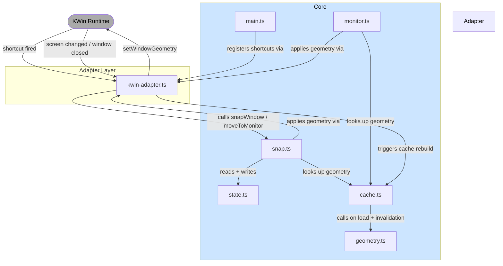

# Rectangle for KDE - Design Document

## Overview

A KWin script that replicates Rectangle's keyboard-driven window snapping for KDE Plasma. Provides direct keyboard shortcuts for snapping windows to specific screen positions with cycling behavior. Targets **Plasma 6 only**.

---

## Core Requirements

### 1. Window Snap Positions

**Edge Snaps (with cycling):**
- Left, Right: width cycles 1/2 → 2/3 → 1/3 → 1/2, height always spans full screen
- Top, Bottom: height cycles 1/2 → 2/3 → 1/3 → 1/2, width always spans full screen
- Pinned to the respective edge

**Center Snap (with cycling):**
- Width cycles: 1/2 → 2/3 → 1/3 → 1/2
- Height always spans full screen
- Centered horizontally

**Corner Snaps (with cycling):**
- Top-Left, Top-Right, Bottom-Left, Bottom-Right
- Width cycles: 1/2 → 2/3 → 1/3 → 1/2
- Height always spans half the screen
- Pinned to the respective corner

**Sixth Snaps:**
- Screen is divided into 6 equal cells:
  - Wide screen (landscape): 2 rows × 3 columns
  - Tall screen (portrait): 3 rows × 2 columns
- 6 shortcuts, one per cell (starting position)
- Hitting the same shortcut repeatedly cycles through all 6 cells in order: left→right, then next row down, wrapping back to cell 1
- Example for wide (2×3):
  ```
  [1][2][3]
  [4][5][6]
  → back to 1
  ```
- Example for tall (3×2):
  ```
  [1][2]
  [3][4]
  [5][6]
  → back to 1
  ```

**Maximize:**
- One-way action (no cycling)
- Returns window to maximized state

**Monitor Navigation:**
- Next Display: Move window to next monitor (in order)
- Previous Display: Move window to previous monitor
- Works on any window, snapped or not
- Before moving, check if the window's current geometry exactly matches its stored snap geometry:
  - **Match**: re-apply the same snap position recalculated for the new monitor's dimensions
  - **No match (or no state)**: best-effort — preserve position as closely as possible, clamp so at least one corner remains visible on the new monitor. No rescaling.

---

## State Management

### Per-Window State

Track for each window:
```
{
  windowId: {
    currentPosition: string,      // "left", "right", "top-left", "center", "sixth-1", etc.
    cycleIndex: number,           // 0, 1, or 2 (for 1/2, 2/3, 1/3); 0-5 for sixths
    currentScreen: number,        // Monitor index
  }
}
```

### State Lifecycle

- **Initialize**: When shortcut fires for a window with no state, set `cycleIndex = 0`
- **Same shortcut fired again**: Increment `cycleIndex` (wraps back to 0)
- **Different position shortcut fired**: Reset `cycleIndex = 0`, update `currentPosition`
- **Manual window movement**: State resets implicitly on the next shortcut fire (no signal tracking needed)
- **Window closed**: Remove state entry

---

## Geometry Calculations

### Input Parameters
- `workArea` (x, y, width, height of usable monitor area — from `workspace.clientArea()`, excludes panels and docks)
- `position` (e.g., "left", "top-right", "sixth-3")
- `cycleIndex` (0, 1, or 2 for standard snaps; 0-5 for sixths)

### Output
- `targetGeometry` (x, y, width, height for window)

### Calculation Logic

**Edge Snaps (Left/Right):**
- Width = workArea width × [1/2, 2/3, 1/3][cycleIndex]
- Height = full workArea height
- x: pin to left or right edge
- y: top of workArea

**Edge Snaps (Top/Bottom):**
- Height = workArea height × [1/2, 2/3, 1/3][cycleIndex]
- Width = full workArea width
- x: left of workArea
- y: pin to top or bottom edge

**Corner Snaps:**
- Width = workArea width × [1/2, 2/3, 1/3][cycleIndex]
- Height = workArea height / 2
- Position in appropriate corner

**Center Snap:**
- Width = workArea width × [1/2, 2/3, 1/3][cycleIndex]
- Height = full workArea height
- Centered horizontally

**Sixth Snaps:**
- Divide workArea into 6 equal cells based on aspect ratio (2×3 or 3×2)
- Cycle order: left→right, top→bottom, wrapping
- Target cell = (startCell + cycleIndex) % 6

**Monitor Cycling:**
- Get list of all connected monitors
- Find current window's current monitor
- Check if window geometry matches cached snap geometry for current monitor
  - If yes: look up same snap position in cache for target monitor and apply
  - If no: offset window position by monitor delta, clamp so at least one corner is visible

---

## Keyboard Shortcuts

### Binding Strategy
- Use KWin's shortcut system (via adapter)
- Shortcuts are customizable via KDE System Settings (no custom UI needed)
- Default to Rectangle-like bindings (e.g., Meta+Alt+Left, Meta+Alt+Right, etc.)

### Shortcut List
- Left, Right, Top, Bottom (4 shortcuts)
- Top-Left, Top-Right, Bottom-Left, Bottom-Right (4 shortcuts)
- Center (1 shortcut)
- Sixth positions 1–6 (6 shortcuts)
- Maximize (1 shortcut)
- Next Display, Previous Display (2 shortcuts)

**Total: 18 shortcuts**

---

## Technical Architecture

### Build System
- TypeScript source files bundled with **esbuild**
- Output: single `contents/code/main.js`
- `package.json` with build and test scripts

### File Structure
```
rectangle-kde/
├── package.json               # Build and test scripts (esbuild + vitest)
├── metadata.json              # KWin script metadata
├── src/
│   ├── main.ts                # Entry point: initializes adapter, registers shortcuts
│   ├── adapter.ts             # KWinAdapter interface definition
│   ├── kwin-adapter.ts        # KWin implementation of adapter (not unit tested)
│   ├── core/
│   │   ├── snap.ts            # Core snap logic: given intent + state, produces geometry + new state
│   │   ├── state.ts           # State management
│   │   ├── cache.ts           # Monitor snap geometry cache
│   │   ├── geometry.ts        # Geometry calculations (called only by cache)
│   │   └── monitor.ts         # Monitor cycling and geometry reprojection
│   └── tests/
│       ├── snap.test.ts
│       ├── state.test.ts
│       ├── cache.test.ts
│       ├── geometry.test.ts
│       └── monitor.test.ts
└── contents/
    └── code/
        └── main.js            # Bundled output (do not edit directly)
```

### Architecture Diagram



### Adapter Interface

All KWin API calls are isolated behind an adapter interface. Core logic never calls KWin globals directly.

```typescript
interface KWinAdapter {
  getActiveWindow(): Window
  getWindowGeometry(window: Window): Rect
  setWindowGeometry(window: Window, geometry: Rect): void
  getClientArea(screen: number): Rect
  getScreens(): Screen[]
  registerShortcut(name: string, key: string, cb: () => void): void
  onWindowClosed(cb: (window: Window) => void): void
  onScreenChanged(cb: () => void): void
}
```

**Flow:**
```
KWin fires shortcut
  → kwin-adapter.ts receives it
  → calls core snapWindow("left", adapter)
    → core reads state, looks up geometry from cache
    → core updates state
    → calls adapter.setWindowGeometry(window, geometry)
      → kwin-adapter.ts applies it via KWin API
```

### Key Components

**main.ts:**
- Instantiates the KWin adapter
- Registers all 18 shortcuts via adapter
- Wires shortcut callbacks to core functions

**adapter.ts:**
- Defines the `KWinAdapter` interface
- No implementation — just the contract

**kwin-adapter.ts:**
- Implements `KWinAdapter` using KWin globals (`workspace`, `KWin`, etc.)
- Not unit tested — manually tested on a real KWin instance

**core/state.ts:**
- Maintain window state map
- Get/set state for a window
- Handle state cleanup on window closed

**core/cache.ts:**
- On load: compute and store all snap geometries for each connected monitor via `geometry.ts`
- Expose snap geometry as a simple lookup: `getSnapGeometry(monitorIndex, position, cycleIndex)`
- Invalidate and rebuild on screen change signals

**core/geometry.ts:**
- Calculate all snap geometries for a given `workArea`
- Pure functions — called only by `cache.ts`

**core/snap.ts:**
- Given a shortcut action, current window state, and cache: returns new geometry and updated state
- Pure logic — no direct KWin calls

**core/monitor.ts:**
- Monitor cycling logic
- Snap-match detection (compare current geometry to cached snap geometry)
- Best-effort clamping for unsnapped windows

### Testing Strategy

- **Test runner**: Vitest
- **Unit tested** (all in `src/tests/`): `geometry.ts`, `state.ts`, `cache.ts`, `snap.ts`, `monitor.ts`
- **Not unit tested**: `kwin-adapter.ts`, `main.ts` — covered by manual testing on KWin
- Core modules are pure functions or accept injected dependencies, no KWin globals required
- `kwin-adapter.ts` is injected at runtime; tests use a mock implementation of `KWinAdapter`

---

## Edge Cases & Considerations

1. **Maximized windows**: Unmaximize before snapping
2. **Very small screens**: Don't snap to sizes smaller than minimum window size
3. **Multi-monitor with different resolutions**: Calculate proportions per monitor via cache
4. **Aspect ratio detection for sixths**: Use workArea width/height ratio to determine 2×3 vs 3×2 layout

---

## Implementation Phases

### Phase 1: MVP
- Project setup: esbuild, TypeScript, Vitest
- Adapter interface + KWin implementation
- Basic edge snaps (left, right, top, bottom) with cycling
- Corner snaps with cycling
- Center snap with cycling
- Maximize
- State tracking
- Unit tests for core modules

### Phase 2: Monitor Support
- Next/Previous Display cycling
- Snap-match detection and geometry reprojection
- Best-effort clamping for unsnapped windows

### Phase 3: Sixths
- Aspect-ratio-based layout detection (2×3 or 3×2)
- 6 shortcuts with full cycle-through behavior

### Phase 4: Polish
- Error handling
- Documentation
- CI: GitHub Actions workflow to build, run tests, package zip, and publish a GitHub Release on merge to main

### Phase 5: Publishing
**CI:** Handled in Phase 4 — GitHub Actions produces a versioned zip as a GitHub Release on merge to main.

**Manual step:**
- Upload the release zip to [store.kde.org](https://store.kde.org) under the **KWin Scripts** category
- The KDE Store (powered by OpenDesktop/Pling) has an OCS API but it is poorly documented and has known auth issues — no reliable automated upload path exists
- Users can install via **System Settings → Window Management → KWin Scripts → Get New…** or directly from the GitHub Release
- No vetting process — community-driven, goes live on submission
